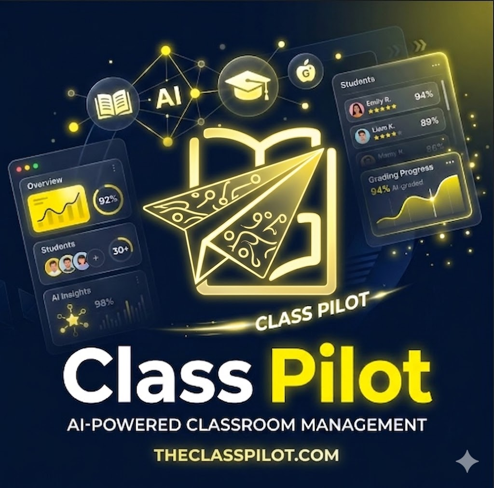

# Class Pilot


**Class Pilot** is a comprehensive, next-generation e-classroom platform built with Next.js 14, TypeScript, Tailwind CSS, and Supabase. It revolutionizes classroom management by integrating AI-powered automated grading, real-time collaboration, and an intuitive, beautiful interface for both teachers and students.

## ✨ Features

- **Automated AI Grading**: GPT-4 powered grading system that reads student submissions, compares them to custom rubrics, and provides instant, detailed feedback.
- **Real-Time Discussions**: Live class feeds and chat powered by Supabase Realtime and Upstash Redis.
- **Complete Class Management**: Join via unique codes, manage members, and organize cohorts securely.
- **Advanced Rubric Builder**: Create highly structured grading rubrics tailored for specific assignments.
- **Dynamic Materials & Assignments**: Seamless file uploads, due date tracking, and rich text instructions.
- **Secure Authentication**: Built on Supabase Auth, keeping student and teacher data isolated and secure.
- **Responsive & Accessible UI**: A dark-mode first, glassmorphic design that works perfectly on desktop and mobile.

## 🛠️ Tech Stack

- **Framework**: Next.js 14+ (App Router)
- **Language**: TypeScript
- **Styling**: Tailwind CSS + Shadcn UI components
- **Database & Auth**: Supabase (PostgreSQL, Storage, Realtime, RLS)
- **AI Engine**: OpenAI API (GPT-4o-mini)
- **Realtime / Cache**: Upstash Redis
- **Emails / Auth Links**: Resend
- **Deployment**: Optimized for Vercel

## 🚀 Getting Started

### Prerequisites
- Node.js 18+ and npm
- [Supabase](https://supabase.com/) account
- [OpenAI](https://openai.com/) API key
- [Upstash Redis](https://upstash.com/) Database
- [Resend](https://resend.com/) API key

### Local Installation

1. **Clone the repository:**
```bash
git clone <repository-url>
cd fyp
```

2. **Install dependencies:**
```bash
npm install
```

3. **Set up local environment variables:**
Create a `.env.local` file in the root directory:
```env
# Supabase
NEXT_PUBLIC_SUPABASE_URL=your_supabase_project_url
NEXT_PUBLIC_SUPABASE_ANON_KEY=your_supabase_anon_key
SUPABASE_SERVICE_ROLE_KEY=your_supabase_service_role_key

# OpenAI
OPENAI_API_KEY=your_openai_api_key

# Upstash Redis
UPSTASH_REDIS_REST_URL=your_upstash_redis_url
UPSTASH_REDIS_REST_TOKEN=your_upstash_redis_token

# Resend
RESEND_API_KEY=your_resend_api_key
RESEND_FROM_EMAIL=updates@theclasspilot.com

# Core App URL
NEXT_PUBLIC_APP_URL=http://localhost:3000
```

4. **Initialize Supabase (Optional for Local DB) / Link to Cloud:**
   - Either run supabase locally `supabase start` or link to your cloud project.
   - Run the initial migrations found in `supabase/migrations`.
   - Ensure you create storage buckets for `assignments`, `materials`, and `avatars`.

5. **Start the Development Server:**
```bash
npm run dev
```
Open [http://localhost:3000](http://localhost:3000) to view the application.

## 🌐 Production Deployment

Class Pilot is optimized for deployment on Vercel. 

1. Push your code to GitHub.
2. Import the repository into Vercel.
3. Supply **all** environment variables exactly as they appear in `.env.local`. Set `NEXT_PUBLIC_APP_URL` to your production domain (e.g., `https://theclasspilot.com`).
4. Ensure your Supabase Dashboard "Redirect URLs" accept your new Vercel domain.
5. If using Cloudflare for DNS, remember to use **DNS Only (Grey Cloud)** for the Vercel `A` and `CNAME` records to let Vercel handle SSL certificates.

## 🏛️ Project Structure

```text
src/
├── actions/            # Validated Next.js Server Actions 
├── app/                # Next.js App Router (Pages, API Routes)
├── components/         # Reusable UI parts
│   ├── features/       # Domain specific (classes, grading, rubrics)
│   ├── layout/         # Shell components (Navbars, Footers)
│   └── ui/             # Generic, unstyled primitive components
├── contexts/           # Global React Contexts (Auth)
├── lib/                # Core business logic layer
│   ├── services/       # Database queries and Supabase wrappers
│   ├── validations/    # Zod Schemas for data integrity
│   └── hooks/          # Custom React hooks
```

## 🔒 Security Principles

- **Server-Side Verification**: Authentication heavily utilizes `@supabase/ssr` server checks.
- **Row Level Security (RLS)**: Users can only read/mutate data belonging to classes they are a confirmed member of.
- **Zod Validation**: Every server action validates requests against strict schemas before touching the DB.

## 📄 License & Contact

Developed as an advanced classroom management solution (Final Year Project). For queries, please open an issue or reach out via our contact page.
